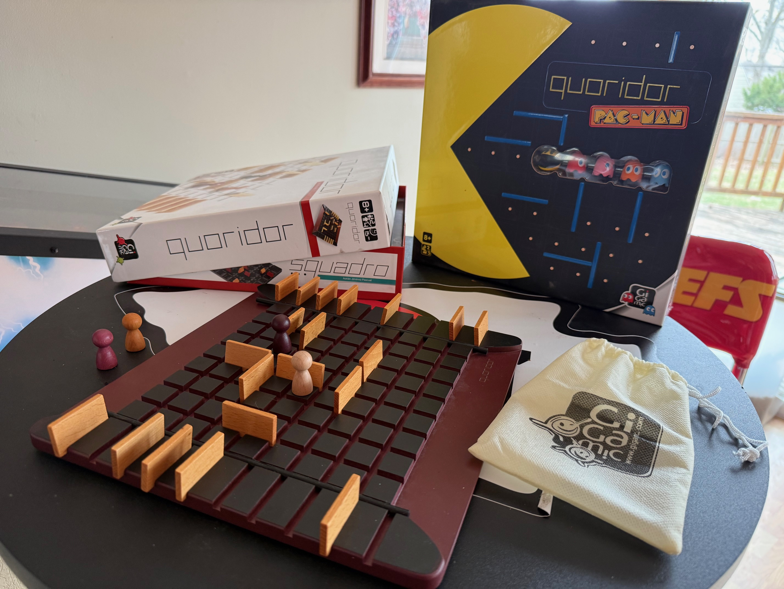
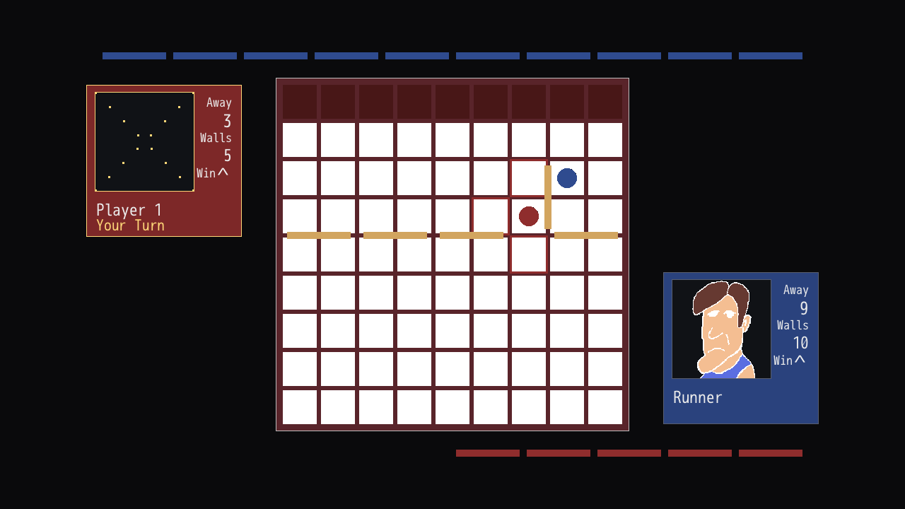

# Hallways

## The Game

Hallways is a DragonRuby implementation of the Quoridor board game.

| Quoridor Board | Screenshot |
| --- | --- |
|  |  |

## The AI

But more than that, this is a presentation of how I recommend starting with AI coding. What I present here is a strategy that I believe will:

* Increase a developer's output, and
* Build the foundation of AI understanding that will lead to greater gains.

This is the first of a few applications that I intend to create without touching the code.  My only interaction with the application's code is through my commands to the AI.

*(oh, and I drew the awful computer player sprites)*

https://darrendoom.itch.io/hallways

## Value Statement

Before I begin, I should set a basic value that I use to compare methods of development:  Ship.  Your code must ship, it must be worthwhile, and the faster the better.  After you ship your code, you should ship more code immediately.  Push.  Don't wait.

Code that does not ship is, at best, a launching point to shipping the next block of code faster.  At worst, it's a waste of time and resources. 

In my career, this value has lead me to development processes like TDD, pairing, small PRs, fast reviews, and daily-hourly-minutely deployments. 

## Applied to AI?

AI development is often portrayed as "let AI do the coding for you."  You tell the AI what to do, and it writes the code -- which is true.  If you tell AI to write an application for you, it will.  With each new model, tool, and AI breakthrough, it seems to be getting better and better.

But is this AI code shipping?  If you coordinate a squadron of AI agents to build a complex SaSS-replacing web service in 8 hours, is your new service deploying in 8 hours + 1 minute?  2 minutes?  2 days, 2 weeks?  Maybe some have, but in my experience most do not.  Most seems very impressed on those initial gains of fast, tremendous output, but then fall apart.

In other words, I don't see AI pushing many AI-using developers into more code shipment.  

## A Different AI Focus

Let the AI do the coding for you.  But do not surrender one inch of your thinking, architecture, and your development flow.  Work exactly as you would without AI, but let it write the code.  

The alternative approach is with heavy prompting, large specifications, greater context requirements, and most importantly:  More time.  Devs are letting AI run for long periods, generating more-and-more code that is less-and-less shippable, and promising it'll be better.

I have seen my strategy work marvels with developers who hold the "ship" value and work with TDD, fast deploys, etc.  And I have seen devs fail when they do not this way with AI -- and it fails for the same reasons their development processes fail without AI.  But the proof is in the pudding, so I'm going to use this project, and others, to demonstrate how AI can be used for good... with good being "shipped."

## The Flow

Build exactly as you would, but only give the AI the next thing you'd do.  Don't get into line-by-line instruction, but rather tell it your intention if you were to write the code.  

> [Prompt] I want to make a Quoridor game that I can deploy on itch.io.  Do not take action without me on this, I want to drive the development of this application step-by-step.
> [Prompt] I want to call this game "Hallways" because that's what my wife calls Quoridor.  Build a blank DragonRuby application for this, but have the application do nothing but show a blank screen.
> [AI] (Done in 1-2 minutes)
> [Bash] git add -p (reviewing the code)
> [Bash] git commit -m 'Initial commit.'

> [Prompt] Ok, great, now I want a Title screen.  I want it to say "Hallways" at the top, then have a Quit button that closes the game.
> [AI] (Done in 1-2 minutes)
> [Bash] git add -p (reviewing the code)
> [Bash] git commit -m 'The beginning of the title screen.'

> [Prompt] Now add a "Play" menu option that, when selected, will open a new blank screen.
> [AI] (Done in 1-2 minutes)
> [Bash] git add -p (reviewing the code)
> [Bash] git commit -m 'Adding a play button.'

Twenty-five short iterations later...

> [Prompt] Extract the wall coordinates and logic in the Game class to a "Wall" class.
> [AI] (Done in 1-2 minutes)
> [Bash] git add -p (reviewing the code)
> [Bash] git commit -m 'Created the first Wall class.'

Thirty iterations later...

> [Prompt] If the player select is a computer player, use a new "Bot" class that inherits from Player, and have it move the pawn in random locations. Don't worry about game logic yet.
> [AI] (Done in 1-2 minutes)
> [Bash] git add -p (reviewing the code)
> [Bash] git commit -m 'Better tests.'

Ten iterations later...

> [Prompt] Now make a second bot that inherits from the PathBot, but change it that if another player reaches 2 squares from their victory, throw up walls to obstruct their way.
> [AI] (Done in 1-2 minutes)
> [Bash] git add -p (reviewing the code)
> [Bash] git commit -m 'A second both that is a little tougher.'

Fifty iterations later...

> [Prompt] Rename the PressureBot as "Cowboy" and use the cowboy sprite that I just dropped into /sprites.
> [AI] (Done in 1-2 minutes)
> [Bash] git add -p (reviewing the code)
> [Bash] git commit -m 'Added the Cowboy.'

Ok, thes aren't the exact commits, but if you look at the 200+ commits in this project, you'll see that it wasn't far off.

## Humans Have Context Limits, Too

Like AI, humans have a limited context, and most programmers are human. We can hold only so much in our heads at one time.

When developers write code **without AI**, they lose mental context over the larger problem as they work with the minutiae of coding.  This results in "context-switching" even when working on a single business problem.  This is one reason why working in short-iterations tends to work well with software development, as it helps to fit deliverables within what a human can perceive and process at any one time.

When developers write code **with AI** to build large applications or features, they lose the mental context of the minutiae of coding entirely.  They don't know what the code is or does, and AI can deliver it at such a large quantity that a developer cannot process it.  So a developer just accepts it without professional review, and resolves to edit it only when needed. The developer has no real handle on whether the code is good or bad.

The approach I am advocating is not "in the middle."  It's a rejection of the latter, and with a refinement of the first.  It is treating the AI as a junior developer who only does what is told, with its output restricted to only what the developer can review at a single time -- by restricting the input and scope of its work.  The benefits the AI work provides to a developer is the lack of need to "context-switch" between the feature and the coding keystroke-by-keystroke, and the speed-boost that AI generated code can provide.  The cost is a lack of precision lost by not following the TDD process (which is the first true human "review" of code), but that precision may not be needed for "boilerplate" types of solutions.  Developers can drop into a more rigorous method for sensitive or risky modules.

## AI as a Junior Dev, But Not Really

The direction we are giving AI is at a level we'd use only on the most junior of junior developers.  Human developers do not want to micro-managed at such a level, as they need the freedom to think through problems and grow.  Human developers take on the responsibility of shipping their code, and as such need a level of control that allows them to meet it.  

AI cannot think, cannot grow, and cannot take responsibility for anything.  What AI has to offer in development, though, is a wide base of (mostly) applicable dev knowledge, tremendous speed, and a lack of defensiveness.  AI is capable of working for hours on a project of monumentous scope... but tell it to wash your developer dishes.  It will happily comply and do it faster and better than you.

I cannot dispute that AI can do much more than what I am asking developers to use it for.  It almost feels like a waste of power to limit it by what a human developer can consume... almost.  My experience with AI has shown me not just its power, but it's fatal flaws.  It can fail randomly at the most basic of tasks, and LLMs do not "think" -- they predict the next token.  Asking AI to do more than human developers can rationally consume puts all of the benefit it can provide at risk, as one wrong keystroke breaks everything.  Left on its own, AI cannot be trusted with mission-critical components as it's too risky.  Combined with a human taking responsibility and wielding it well, AI would lower risk.

## AI Puts Iterative Design Over Planning

We plan our development work to avoid waste and provide accurate estimates of delivery.  Bad planning can be catastrophic to a project and waste hundreds of person-hours, especially when bringing in software development.  We must think through our proposed solutions thorougly, find all of the paths that might cause unplanned work, and prepare the requirements to avoid developer confusion.

But what if the opposite was true?  What if development time was shrunk to the level that it is faster and less risky to jump into a solution head-first, quickly finding the "happy path" and running smack-dab into the unknowns that would otherwise thrwart our plan?  What if AI made "rework" a cheaper alternative to weeks or months of planning?  What if the software development became so nimble that change was embraced, rather than avoided?

## agents.md

This file exists to provide context to the AI agent on how it should behave.

Those who build wildly with AI will use this file as their control, a way to guide the AI.  "Write the code well," "refactor when necessary," "test your code," etc.  All high-minded ideas. These files contains so much context in addition to the problem being solved, I'm not sure they're worth the context they spend.

With the approach I used for Hallways, I told the AI to use it to keep notes to better prepare itself for future development.  I'd have it update this file whenever it seemed like we had made significant progress.

I can't think of a more concrete example of the differences in this approach.

## Codex

I built this using Codex, as I realized I had a lot of tokens with it with my general ChatGPT subscription.  For the entirety of the app's development to 1.0, I used about 30% of my weekly allocated tokens from a $20 subscription.

I've used other Ais, and I think I can confidently say:  If you code with AI at this level, all of today's AI models all work the same.

## Summary

I tried to make this game in 2024.  I was also about 200 commits over 4 weeks in before I stopped, as it was just taking too long for a side project.  It was mentally frustrating to context switch in-and-out of the inner details of a board game.  

With AI, I shipped at 200 commits, and I used a small fraction of the mental effort.  Most of the dev work was done with my focus on other things, as I'd come back to my computer to see where the AI had left off so I could move forward with the next step.

## Time Log

- 2026-03-14: Initial project setup; test mode/test runner added; title flow established; core model work started (`Game`, `Board`, `Pawn`, `Wall`, `Player`) with early move/wall rules and rendering refactors.
- 2026-03-15: Input and gameplay interaction improved with mouse/menu handling, wall drop behavior, controller abstraction, and early human-vs-player mode work.
- 2026-03-16: Publishing pipeline work for itch.io and GitHub Actions, plus test-runner stabilization and deployment iteration.
- 2026-03-17: Major architecture cleanup (models/controllers/renderers/screens split), bot system growth (random/path/pressure behavior), renderer improvements, sprite updates, and version/deploy flow tightening.
- 2026-03-19: Runtime split/refactor continued, 4-player progress, turn/wall interaction polish, visual updates, docs/agent guidance updates, and pause/continue UX additions.
- 2026-03-20: Heavy gameplay/UI iteration: animation and movement improvements, one-click pawn/wall placement, wall-placement extraction, shared bot/code consolidation, and setup/player-box layout polishing.
- 2026-03-21: Performance and UX pass: FPS/debug instrumentation, movement speed tuning, wall/player visual cues, direction indicator work, fullscreen shortcut, and version bump.
- 2026-03-22: Content and release polish: new bot identities/sprites (Caveman, Runner, Cowboy), title/background/player display refinements, highlight tuning, debug overlay cleanup, test fixes, and `1.0.0` bump.


## Others

### Play

- Playable via browser at: https://darrendoom.itch.io/hallways
- Better performance from download Windows/Linux/Mac version.

### Requirements

- DragonRuby Game Toolkit (https://dragonruby.org).
- This repo in a folder next to your `dragonruby` executable.

### Run The Game

From the parent directory (example: `dragonruby-mine`):

```bash
./dragonruby ./hallways
```
### Run Tests

DragonRuby test mode requires a test-path argument.

From the parent directory:

```bash
./dragonruby ./hallways --test app/test_runner.rb
```
Expected behavior:
- Test output is printed to console.
- DragonRuby exits automatically after tests complete.
- Warnings in test output should be treated as failures to investigate, even if process exit is successful.
- Custom test summary is written to `test-output.txt` for automation checks.

### Notes

- Quoridor information:  (https://en.wikipedia.org/wiki/Quoridor)


